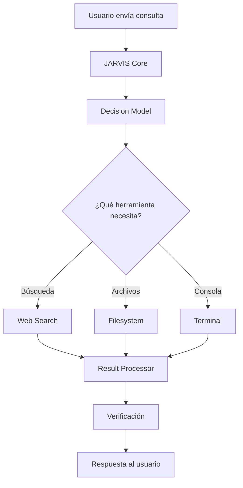

```mermaid
flowchart TD
    A[Usuario envía consulta] --> B[JARVIS Core]
    B --> C[Decision Model]
    C --> D{¿Qué herramienta necesita?}
    D -->|Búsqueda| E[Web Search]
    D -->|Archivos| F[Filesystem]
    D -->|Consola| G[Terminal]
    E --> H[Result Processor]
    F --> H
    G --> H
    H --> I[Verificación]
    I --> J[Respuesta al usuario]
```